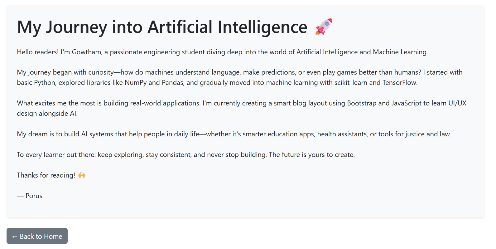

# 📰 Simple Blog Layout Using Bootstrap 5

This is a responsive and dynamic blog layout created using **Bootstrap 5**. The project includes a homepage with blog cards, a search bar to filter posts, and a detail page for reading full blog articles. It is built with clean HTML, Bootstrap classes, and plain JavaScript — perfect for beginners learning frontend development.

## 📸 Demo
|

## 🎯 Objective

Build a functional and mobile-responsive blog page using Bootstrap 5 CDN. The layout demonstrates key Bootstrap components like navbar, cards, grid system, and utility classes — without relying on any external CSS frameworks.

## 🔧 Tools & Technologies Used

- Visual Studio Code (or any code editor)
- HTML5 + JavaScript
- Bootstrap 5 CDN
- Bootstrap Icons CDN
- Web Browser (Chrome, Firefox, etc.)

## 📂 Project Structure

📁 blog-project/
├── index.html # Main blog page with post listings and search bar
├── blog-details.html # Detail page to show full blog content
├── index.png # Screenshot of homepage layout
├── bilgdis.png # Screenshot of blog details view

## ✨ Features

- ✅ Integrated Bootstrap 5 and Bootstrap Icons via CDN
- ✅ Mobile-first responsive design
- ✅ Top navigation bar with links
- ✅ Live search bar for filtering blog posts by title
- ✅ Blog cards with title, description, and Read More button
- ✅ Detail page for full content (passed via `localStorage`)
- ✅ Footer with social icons
- ✅ Clean layout using Bootstrap utility classes (spacing, colors)

## 📱 Responsive Design

This blog layout is fully responsive. It has been tested on:
- Desktop screens
- Tablets
- Mobile devices

The layout adjusts using Bootstrap’s grid system (`row`, `col-md-4`, etc.) and spacing classes (`mt-4`, `py-2`, etc.).

## 📚 Key Concepts Covered

- Bootstrap 5 grid and layout system
- Creating responsive components with utility classes
- DOM manipulation in JavaScript
- Passing data between pages using `localStorage`
- Clean HTML structure with no extra dependencies

## 🚀 How to Run This Project

1. Clone this repo or download the folder.
2. Open `index.html` in your preferred browser.
3. Use the search bar to filter blog posts by title.
4. Click on any "Read More" button to view full content in `blog-details.html`.

## 👨‍💻 Author

**Dondapati Theerdha Purushotham**  
Aspiring Artificial Intelligence and Web Developer. Passionate about building intelligent, useful, and user-friendly applications using frontend and backend technologies.

## 📜 License

This project is created for learning and educational purposes.  
You’re free to reuse, modify, or expand it for personal or academic use.
